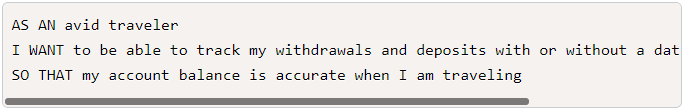
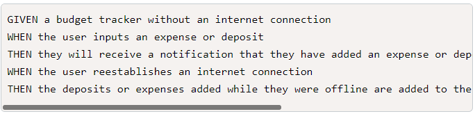
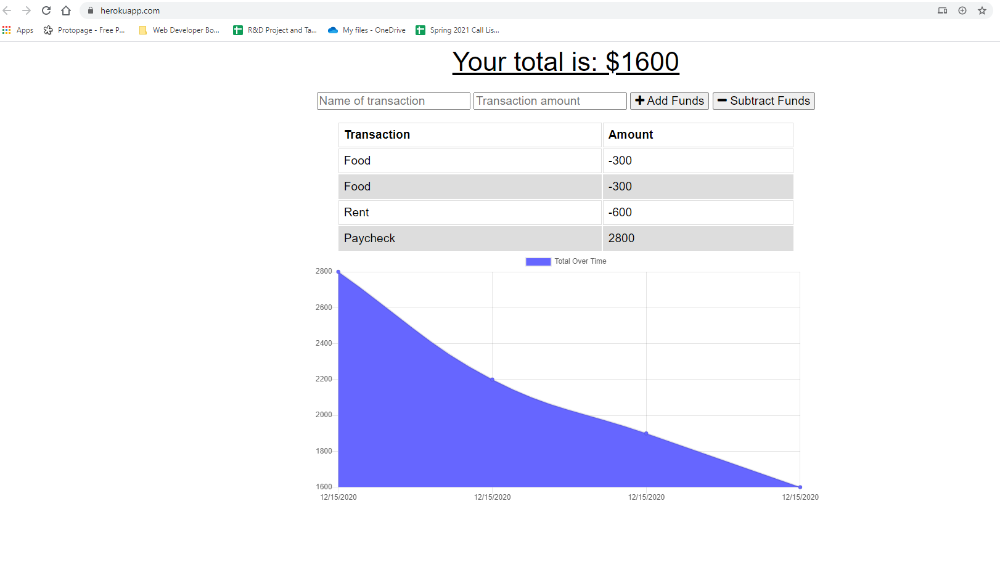

# Budget Tracker Starter Code

## Description
Application tracks finances both online and offline using a service-worker, indexedDB, and a manifest so that the application can be installed locally. 

## Github Repo
[Github Repo link](https://github.com/catse2000/budget-tracker)

## Deployed Application
[Heroku Budget Tracker Application](https://shrouded-atoll-40459.herokuapp.com/)
## User Story

## Acceptance Criteria

## Application Screenshot
